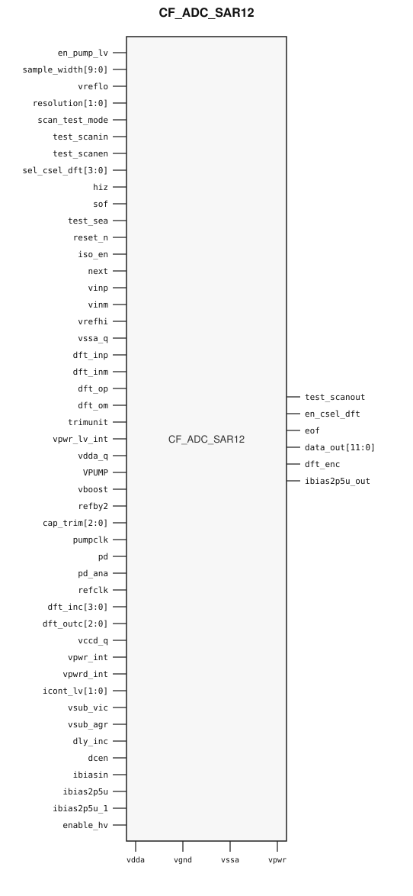

# CF_ADC_SAR12

> 12-bit SAR ADC

Draft for designer review. Electrical values below are transcribed from the
packaging source extract. The public GDS is an abstract; ChipFoundry
substitutes protected full geometry at tapeout.

This package ships an SRAM-style PG wrap `CF_ADC_SAR12` around analog leaf
`CF_ADC_SAR12_core`, plus companion `CF_ADC_SAR12_sar_refs` (unwrapped
reference system). Instantiate `CF_ADC_SAR12`. Place `CF_ADC_SAR12_sar_refs`
and wire `REFHI` / `REFBY2` into `vrefhi` / `refby2` unless you are using an
external reference.

## Overview

`CF_ADC_SAR12` is a SkyWater 130 nm hard macro: a 12-bit successive-
approximation ADC for general-purpose conversion. Maximum throughput is
1 Msps when `refclk` is 18 MHz. The companion `CF_ADC_SAR12_sar_refs` block
provides the on-macro reference buffer, reference mux, and `REFHI` / `REFBY2`
/ `refout` outputs.

Differential analog inputs are `vinp` and `vinm`. Conversion framing uses
`sof` (start of frame, input), `eof` (end of frame, output), and `next`.
The 12-bit result is `data_out[11:0]`. `pd` and `pd_ana` are power-down
controls.

An external-reference mode is supported: drive `vrefhi` / `vreflo` /
`refby2` from chip-level references instead of the on-macro reference
outputs when system-level accuracy requires it.

Customer cell `CF_ADC_SAR12` is 503.24 × 533 µm (15 µm halo around analog
leaf 473.24 × 503 µm). The reference macro is 503 × 129.835 µm. Chip PDN is
`vpwr` / `vgnd`. Vendor digital pads `vccd` / `vssd` are tied inside the
wrap. Analog supplies stay wrap ports.

## Installation

```bash
pip install cf-ipm
ipm install CF_ADC_SAR12 --version 0.2.0 --include-drafts
```

Until the marketplace listing is published, install from a local catalog
override the same way `cf-adc-sar12-test-project` does:

```bash
ipm install CF_ADC_SAR12 --version 0.2.0 --include-drafts --local-file ip/catalog.json
```

Use `hdl/gl/CF_ADC_SAR12.v` as the customer blackbox, `layout/lef/CF_ADC_SAR12.lef`
for P&R, and `layout/gds/CF_ADC_SAR12.gds` / `layout/mag/CF_ADC_SAR12.mag` for
the public wrap. `CF_ADC_SAR12_core` is the analog leaf (empty Verilog,
pin-only abstract). ChipFoundry substitutes vault GDS into
`CF_ADC_SAR12_core` at tapeout. `timing/lib/` is the characterized analog
view; P&R uses the wrap LEF (`vpwr` / `vgnd` plus analog supplies).

## Features

- 12-bit successive-approximation conversion at up to 1 Msps
- `refclk` 18 MHz for the 1 Msps mode
- Differential analog inputs `vinp` / `vinm`
- On-macro reference system with mux and buffer (`CF_ADC_SAR12_sar_refs`)
- External reference mode via `vrefhi` / `vreflo` / `refby2`
- 12-bit `data_out` with `sof` / `eof` framing
- Separate analog (`pd_ana`) and block (`pd`) power-down
- Customer cell `CF_ADC_SAR12` 503.24 × 533 µm (15 µm halo around analog leaf 473.24 × 503 µm)
- Chip PDN is `vpwr` / `vgnd`. Vendor `vccd` / `vssd` are tied inside the wrap.

## Pinout

Customer documentation includes a pinout of the integration cell only.
Internal schematics and architecture block diagrams are not published.



Pin names and directions match the public wrap (`layout/lef/CF_ADC_SAR12.lef`)
and the blackbox stub (`hdl/gl/CF_ADC_SAR12.v`). The reference macro is
documented in the pin table below; it is not shown on this pinout.

## Pin Description

Directions and widths are taken from the shipped Verilog in `hdl/gl/CF_ADC_SAR12.v`.
Descriptions are from the packaging extract where they match that stub.

### `CF_ADC_SAR12` analog

| Pin | Direction | Width | Notes |
|---|---|---:|---|
| vinp | input | 1 | Positive analog input |
| vinm | input | 1 | Negative analog input |
| vrefhi | input | 1 | High reference; typically `REFHI` from the reference macro |
| vreflo | inout | 1 | Low reference / analog ground |
| refby2 | input | 1 | Mid reference; typically `REFBY2` from the reference macro |
| ibias2p5u | input | 1 | 2.5 µA bias input |
| ibias2p5u_1 | input | 1 | Companion 2.5 µA bias input |
| ibias2p5u_out | output | 1 | 2.5 µA bias output |
| ibiasin | inout | 1 | Legacy bias; leave unconnected |

### `CF_ADC_SAR12` conversion and control

| Pin | Direction | Width | Notes |
|---|---|---:|---|
| refclk | input | 1 | Conversion clock (18 MHz for 1 Msps) |
| sof | input | 1 | Start of frame |
| eof | output | 1 | End of frame |
| next | input | 1 | Next-sample control on this abstract |
| data_out | output | 12 | Conversion result |
| resolution | input | 2 | Resolution control |
| sample_width | input | 10 | Sample window |
| cap_trim | input | 3 | Capacitor trim |
| pd | input | 1 | Block power-down |
| pd_ana | input | 1 | Analog power-down |
| reset_n | input | 1 | Active-low reset |
| hiz | input | 1 | High-Z control |
| iso_en | input | 1 | Isolation enable |
| enable_hv | input | 1 | High-voltage enable |
| trimunit | input | 1 | Trim unit enable |
| icont_lv | input | 2 | Low-voltage current control |
| dly_inc | input | 1 | Delay increment |
| dcen | input | 1 | DC enable |
| pumpclk | input | 1 | Charge-pump clock |
| en_pump_lv | input | 1 | Low-voltage pump enable |

### `CF_ADC_SAR12` DFT and scan

| Pin | Direction | Width |
|---|---|---:|
| dft_inp | inout | 1 |
| dft_inm | inout | 1 |
| dft_op | inout | 1 |
| dft_om | inout | 1 |
| dft_inc | input | 4 |
| dft_outc | input | 3 |
| dft_enc | output | 1 |
| en_csel_dft | output | 1 |
| sel_csel_dft | input | 4 |
| scan_test_mode | input | 1 |
| test_scanin | input | 1 |
| test_scanen | input | 1 |
| test_scanout | output | 1 |
| test_sea | input | 1 |

### `CF_ADC_SAR12` supplies

| Pin | Direction | Width | Notes |
|---|---|---:|---|
| vpwr | input | 1 | Chip digital PDN. Wrap ties core `vccd` here. |
| vgnd | input | 1 | Chip digital ground. Wrap ties core `vssd` here. |
| vdda | inout | 1 | Analog supply; route separately (LEF USE SIGNAL) |
| vdda_q | inout | 1 | Quiet analog supply |
| vssa | inout | 1 | Analog ground |
| vssa_q | inout | 1 | Quiet analog ground |
| VPUMP | inout | 1 | Charge-pump supply |
| vboost | inout | 1 | Boost supply |
| vpwr_int | inout | 1 | Internal analog supply |
| vpwr_lv_int | inout | 1 | Internal low-voltage supply |
| vpwrd_int | inout | 1 | Internal digital supply |
| vccd_q | inout | 1 | Quiet digital supply |
| vsub_vic | inout | 1 | Substrate |
| vsub_agr | inout | 1 | Analog-ground substrate |

This leaf has no named well taps. In OpenLane / LibreLane, hook chip PDN with
`PDN_MACRO_CONNECTIONS: "u_cf_adc_sar12 vccd1 vssd1 vpwr vgnd"` and connect
`.vpwr(vccd1)`, `.vgnd(vssd1)` under `USE_POWER_PINS`. Route analog supplies
and analog I/O separately. Do not list vendor `vccd` / `vssd` on the wrapper
instance.

### `CF_ADC_SAR12_sar_refs`

Unwrapped companion. Supplies remain vendor `vccd` / `vssd` plus analog rails.

| Pin | Direction | Width | Notes |
|---|---|---:|---|
| REFHI | output | 1 | High reference to core `vrefhi` |
| REFBY2 | output | 1 | Mid reference to core `refby2` |
| refout | output | 1 | Buffered reference output |
| refout_en | input | 1 | Enable `refout` |
| vref | input | 5 | Reference mux inputs |
| muxsarref | input | 3 | Reference mux select |
| PWR_CTRL_VREF | input | 2 | Reference power control |
| S_LV | input | 8 | Low-voltage select |
| px | inout | 1 | Analog probe |
| px_in | inout | 1 | Analog probe in |
| en_pxin_cap | output | 1 | Probe-cap enable (legacy) |
| IREF_VCMBUF | input | 1 | VCM-buffer bias |
| IREF_VREFBUF | input | 1 | Reference-buffer bias |
| pd | input | 1 | Power-down |
| pd_ana | input | 1 | Analog power-down |
| pd_vcmbuf | input | 1 | VCM-buffer power-down |
| PD_BUF_VREF | input | 1 | Reference-buffer power-down |
| EN_RESVDA | input | 1 | VDA reservoir enable |
| enable_hv | input | 1 | High-voltage enable |
| enpdb_hv | input | 1 | HV power-down bar |
| hiz | input | 1 | High-Z |
| sw_start | input | 1 | Switch start |
| sw_holdb | input | 1 | Hold (active low) |
| dft_comp_en | input | 1 | DFT comparator enable |
| vda_int | output | 1 | Internal analog supply |
| vpwrd_int | output | 1 | Internal digital supply |
| vdda | inout | 1 | Analog supply |
| vccd | inout | 1 | Digital supply (unwrapped) |
| VPUMP | inout | 1 | Charge-pump supply |
| vssa | inout | 1 | Analog ground |
| vssd | inout | 1 | Digital ground (unwrapped) |
| vssa_shield | inout | 1 | Shield ground |

## Specifications

Electrical values belong in Liberty. Typical corner
`timing/lib/CF_ADC_SAR12_tt_25C_1p8V_3p3V.lib` matches the core abstract pin
set. The reference-macro Liberty covers 28 of 46 LEF pins; analog trim and
mux buses `vref[4:0]`, `S_LV[7:0]`, `muxsarref[2:0]`, and `PWR_CTRL_VREF[1:0]`
are on the abstract only.

| Item | Value |
|---|---|
| Resolution | 12 bits |
| Throughput | 1 Msps at `refclk` = 18 MHz |
| Analog inputs | Differential `vinp` / `vinm` |
| Customer wrap | 503.24 × 533 µm |
| Analog leaf | 473.24 × 503 µm |
| Reference-macro size | 503 × 129.835 µm |
| Process | SkyWater 130 nm |

## Timing Diagram

A conversion starts when `sof` is asserted with `refclk` running and `pd` /
`pd_ana` held inactive. `data_out[11:0]` is valid when `eof` rises. Copy
setup/hold and the `sample_width` field encoding from the matching Liberty
view.

## Limitations and Open Issues

- Verilog in `hdl/gl/CF_ADC_SAR12.v` is a structural wrap around an empty
  `CF_ADC_SAR12_core` blackbox, not a SPICE-accurate model.
- `CF_ADC_SAR12_sar_refs` is not PG-wrapped this round (west-edge `vssd`).
- `CF_ADC_SAR12_sar_refs` Liberty does not include analog buses `vref[4:0]`,
  `S_LV[7:0]`, `muxsarref[2:0]`, or `PWR_CTRL_VREF[1:0]`.
- `ibiasin` is a legacy pin; leave it unconnected.
- Analog wrap supplies use LEF `USE SIGNAL` so OpenLane will route them.
- Liberty may still list leaf `vccd` / `vssd`; P&R uses the wrap LEF.
- `en_csel_dft` is an output and `next` is an input on this abstract.
- Public wrap uses Sky130 `prBoundary` 235/4, OBS on li1/met1/met2 blockage
  datatype 10, north-halo met3 PG straps, full-height met4 `vpwr`/`vgnd`
  notched around analog met4 pads, and a Magic `layout/mag` view.

## Tapeout History

This hard macro has high-volume commercial production history (millions of
units). Catalog and IPM maturity is Production.

This ChipFoundry SkyWater 130 nm package delivers an abstract for
integration. ChipFoundry substitutes protected full layout at tapeout.
The chipIgnite delivery of this package is not marked shuttle-proven until
a run returns.

| Version | Date | Notes |
|---|---|---|
| 0.1.0 | 2026-09-04 | First unpublished IPM draft. Two public cells under `CF_ADC_SAR12*` names. Pinout-only customer docs. |
| 0.2.0 | 2026-09-05 | SRAM-style PG wrap: analog leaf is `CF_ADC_SAR12_core`; customer `CF_ADC_SAR12` exposes chip PDN `vpwr`/`vgnd`. Companion `CF_ADC_SAR12_sar_refs` remains unwrapped. Liberty shipped. |
